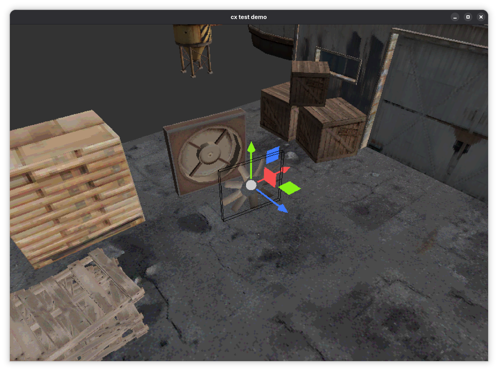

# cx

A game engine development project with a few core principles:
 1. **Written in strict C99**. Stable, feature-complete C99 is widely-supported by many compilers, and most importantly, it is low-level, simple, and fast.
 2. **Lightweight, functional, flat architecture**. This type of software architecture is simple and easy to navigate. The focus here is implementation and functionality, not code structure.
 3. **As few dependencies as practicably possible**. Not relying on dependencies forces me to write my own systems, which in turn forces me to learn how those systems work. It also gives me fine control of what this project encompasses.

Since this project should have few dependencies, the list of systems involved in completing this project is long and ambitious. A rough overview:
 - Native platform window creation and management
 - Native platform input handling
 - Windows (Win32) and Linux (X11) support
 - Graphics API context creation and management
 - 3D rendering
 - 3D physics simulation
 - Graphical user interface
 - Audio
 - Scene and entity management
 - Integrated editing tools
 - Debugging tools
 - Asset management (importing, serialization)

## Third-party contributions
 - Sean Barrett (aka *nothings*), [stb project - a collection of single-file libraries](https://github.com/nothings/stb):
   - [stb_image.h](https://github.com/nothings/stb/blob/master/stb_image.h) for loading various image file types

## Project coding conventions

This project maintains a set of coding conventions which can be found here: [conventions.md](./conventions.md)

## Bibliography

A list of resources I've used throughout this project which I've found very useful.

- [C standard library reference](https://cppreference.com/w/c.html)
- [Casey Muratori - Implementing GJK](https://caseymuratori.com/blog_0003)
- [Dirk Gregorius (Valve) - Implementing Quickhull](https://media.steampowered.com/apps/valve/2014/DirkGregorius_ImplementingQuickHull.pdf)
- [Iain Winter - Designing a physics engine](https://winter.dev/articles/physics-engine)
- [Iain Winter - IwEngine](https://github.com/IainWinter/IwEngine/tree/master)
- [Khronos - glTF 2.0 specification](https://registry.khronos.org/glTF/specs/2.0/glTF-2.0.html)
- [Khronos - OpenGL reference pages](https://registry.khronos.org/OpenGL-Refpages/gl4/)
- [Microsoft - Win32 API reference](https://learn.microsoft.com/en-us/windows/win32/api/)
- [X.org - X11 API reference](https://www.x.org/releases/current/doc/libX11/libX11/libX11.html)
